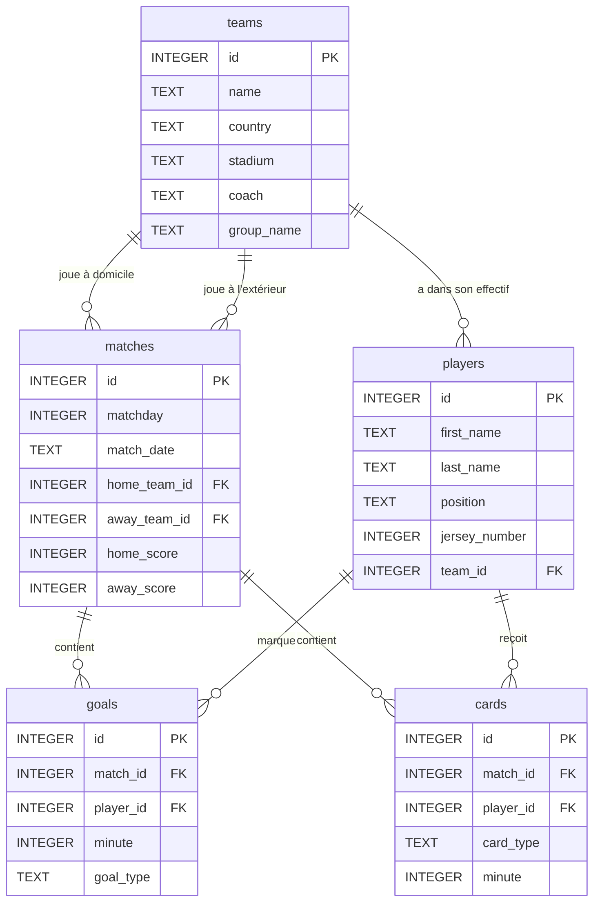

# 🏗️ DESIGN.md — Document de Conception

## 1. Description des Entités

La base de données est composée de **5 tables** qui modélisent la phase de groupes de la Ligue des Champions.

### Table `teams` — Les équipes

Stocke les 16 clubs participant à la compétition.

| Colonne | Type | Description |
|---------|------|-------------|
| `id` | INTEGER | Identifiant unique (clé primaire) |
| `name` | TEXT | Nom du club (ex : "FC Barcelone") |
| `country` | TEXT | Pays d'origine (ex : "Espagne") |
| `stadium` | TEXT | Nom du stade principal (ex : "Camp Nou") |
| `coach` | TEXT | Nom de l'entraîneur |
| `group_name` | TEXT | Groupe attribué : A, B, C ou D |

### Table `players` — Les joueurs

Stocke les joueurs inscrits pour la compétition (environ 10 par équipe pour simplifier).

| Colonne | Type | Description |
|---------|------|-------------|
| `id` | INTEGER | Identifiant unique (clé primaire) |
| `first_name` | TEXT | Prénom du joueur |
| `last_name` | TEXT | Nom de famille |
| `position` | TEXT | Poste : "Gardien", "Défenseur", "Milieu" ou "Attaquant" |
| `jersey_number` | INTEGER | Numéro de maillot |
| `team_id` | INTEGER | Clé étrangère → `teams(id)` |

### Table `matches` — Les matchs

Stocke les 24 matchs de la phase de groupes (6 par groupe).

| Colonne | Type | Description |
|---------|------|-------------|
| `id` | INTEGER | Identifiant unique (clé primaire) |
| `matchday` | INTEGER | Journée de compétition (1, 2 ou 3) |
| `match_date` | TEXT | Date du match (format YYYY-MM-DD) |
| `home_team_id` | INTEGER | Clé étrangère → `teams(id)` (équipe à domicile) |
| `away_team_id` | INTEGER | Clé étrangère → `teams(id)` (équipe à l'extérieur) |
| `home_score` | INTEGER | Buts marqués par l'équipe à domicile |
| `away_score` | INTEGER | Buts marqués par l'équipe à l'extérieur |

### Table `goals` — Les buts

Stocke chaque but marqué pendant la compétition avec le détail (minute, type).

| Colonne | Type | Description |
|---------|------|-------------|
| `id` | INTEGER | Identifiant unique (clé primaire) |
| `match_id` | INTEGER | Clé étrangère → `matches(id)` |
| `player_id` | INTEGER | Clé étrangère → `players(id)` (buteur) |
| `minute` | INTEGER | Minute du but (1 à 90) |
| `goal_type` | TEXT | Type : "normal", "penalty" ou "csc" (contre son camp) |

### Table `cards` — Les cartons

Stocke les cartons jaunes et rouges distribués pendant les matchs.

| Colonne | Type | Description |
|---------|------|-------------|
| `id` | INTEGER | Identifiant unique (clé primaire) |
| `match_id` | INTEGER | Clé étrangère → `matches(id)` |
| `player_id` | INTEGER | Clé étrangère → `players(id)` |
| `card_type` | TEXT | Type : "jaune" ou "rouge" |
| `minute` | INTEGER | Minute du carton (1 à 90) |

---

## 2. Relations entre les Entités

Les relations sont les suivantes :

- **Une équipe** possède **plusieurs joueurs** → relation 1:N entre `teams` et `players`
- **Une équipe** joue **plusieurs matchs** (à domicile ou à l'extérieur) → relation 1:N entre `teams` et `matches` (deux fois : via `home_team_id` et `away_team_id`)
- **Un match** contient **zéro ou plusieurs buts** → relation 1:N entre `matches` et `goals`
- **Un match** contient **zéro ou plusieurs cartons** → relation 1:N entre `matches` et `cards`
- **Un joueur** peut marquer **plusieurs buts** → relation 1:N entre `players` et `goals`
- **Un joueur** peut recevoir **plusieurs cartons** → relation 1:N entre `players` et `cards`

---

## 3. Diagramme Entité-Relation

---

## 4. Choix de Conception

### Pourquoi le groupe est stocké dans `teams` et non dans une table séparée ?

Chaque équipe appartient à **exactement un groupe**, et un groupe n'a pas d'autres attributs que son nom (A, B, C, D). Créer une table `groups` avec seulement un `id` et un `name` ajouterait de la complexité sans réel bénéfice. On utilise simplement une colonne `group_name` dans `teams` avec une contrainte `CHECK`.

### Pourquoi séparer `goals` et `cards` des `matches` ?

Stocker les buts et cartons directement dans la table `matches` rendrait impossible d'avoir plusieurs buts par match. En les séparant dans des tables dédiées, on respecte la **première forme normale** (pas de valeurs multiples dans une cellule) et on peut facilement requêter les statistiques par joueur.

### Pourquoi `home_score` et `away_score` dans `matches` alors qu'on a la table `goals` ?

C'est une **redondance volontaire** pour simplifier les requêtes de classement. Calculer le score à partir de la table `goals` nécessiterait une sous-requête à chaque fois. Le score final dans `matches` sert de résumé rapide. En production, on utiliserait un trigger pour garder la cohérence.

### Pourquoi TEXT pour les dates dans SQLite ?

SQLite n'a pas de vrai type `DATE`. La convention est d'utiliser `TEXT` au format `YYYY-MM-DD`, ce qui permet le tri chronologique et les comparaisons directement en SQL.

### Pourquoi ~10 joueurs par équipe et non 25 ?

Pour garder le jeu de données lisible et le fichier `seed.sql` maintenable. 10 joueurs × 16 équipes = 160 joueurs, ce qui est largement suffisant pour démontrer les requêtes.

---

## 5. Limitations Connues

- **Pas de phase éliminatoire** : le modèle ne gère que la phase de groupes, pas les huitièmes de finale et au-delà.
- **Pas d'arbitres** : pour simplifier, les arbitres ne sont pas modélisés.
- **Pas de remplacements** : on ne suit pas les entrées/sorties de joueurs en cours de match.
- **Pas de passes décisives** : seul le buteur est enregistré, pas le passeur.
- **Score redondant** : le score dans `matches` doit rester cohérent avec les buts dans `goals` (pas de trigger automatique dans cette version).
- **Un seul stade par équipe** : en réalité, certains clubs peuvent jouer dans un autre stade exceptionnellement.
